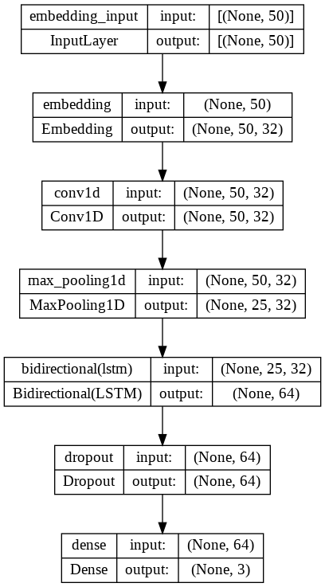

# Twitter-sentiment-analysis
This repo talks about performing sentiment analysis on tweets from twitter and creating a FLASK application to see which category a tweet will fall into, that is either Positive, Neutral or Negative.

Attaching the Link for the Python Notebook: https://colab.research.google.com/drive/1tm18vP0lTZ5pQtOdpDMA5tXd2qRJHEf4?usp=sharing

## Aim
When we provide a twitter handle of a user, it performs sentiment analysis on the recent 20 tweets done by the user. It also displays which category a particular tweet belongs. The categories are Positive, Negative and Neutral.

# Getting Started
## Dataset Chosen
In the rootfolder, a file named "Twitter_Data.csv" is the datset used.
The Dataset used here is a labelled dataset which consists of tweets divided as Positive, Neutral and Negative. A snippet below shows the distribution of the tweets from the chosen dataset in the mentioned categories.

### Attaching a snippet showing Distribution of Text length for Positive Sentiment tweets.   

### Attaching a snippet showing Distribution of Text length for Negative Sentiment tweets.   

### A pie chart representing categories of tweets.   

## Steps carried out

Dataset is already chosen.   
Perform Exploratory Data Analysis(EDA) and observe all the graphs. You can see information about this in the colab  notebook attached at the top of this file.   
Perform Preprocessing.   
Create a model.    
For the NLP tasks, it is suggestable to make use of LSTM model, hence, implemented that.   
Snippet attached below shows how the model created above looks like:   

Model evaluation    
Metrics observed are:   
Accuracy  : 0.8865   
Precision : 0.8890   
Recall    : 0.8827   
F1 Score  : 0.8859   

A plot showing the model accuracy and model losses.

A snippet showing Confusion matrix

Now, it time for observing the results. A snippet attached below shows the sentiment for a given tweet.

So far, the training is done. Now, we need to create a FLASK application. For achieving this, I used FLASK python framework for creating a web server and obtain inputs from the web app.   

You need to have a user handle as that is the input that will be provided to obtain the tweets. There are different ways to obtain the tweets.   
Twitter API   
Selenium/Beautiful soup   
Tweepy library   

Here, I used a library known as snscrape. This is a library which doesn't require user credentials for accessing the tweets and here there is no limit for the number of tweets accessed unlike the twitter API. 
The data collected/ displayed is the date when the tweet was made, username,and, the tweet. All these are put into a dataframe.   

Once the tweets are retrieved, sentiment analysis has to be perfomed. Every tweet will go through the model that we created and trained and that particular tweet will be categorized into either Positive, Neutral or Negative. This value is now added as a column to the dataframe that is saved in the previous step.
This dataframe will now be fed into a HTML table using flask for obtaining the required results.   

## Results
The results shown here are obtained by passing the user handle as "elonmusk" and click on the button "Predict Tweets", your results will be loaded as attached below.

### Home Page

### Predicted Tweets

## How to Run this code in your machine

Clone this repo   
If you are using VS Code, go to this folder   
From the root folder: run, python app.py   